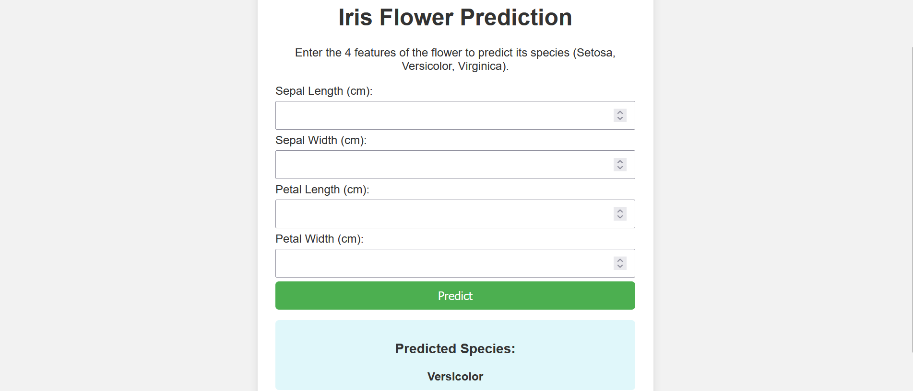

# 🌸 Iris Flower Prediction & Deployment

A hobby machine learning project that predicts the species of an Iris flower based on user input features. Built with **Flask**, trained using **scikit-learn**, and deployed on **Render**.

[](https://iris-flower-prediction-by-habibur.onrender.com)

---

## 🔍 Project Overview

This web app lets users input measurements of an Iris flower (sepal and petal length/width) and instantly predicts the flower species using a trained classification model.

---

## ⚙️ Tech Stack

- 🧠 **Machine Learning**: Scikit-learn, Pandas, NumPy  
- 🌐 **Backend**: Flask  
- 🎯 **Model Deployment**: Render  
- 🐍 **Language**: Python  

---

## 🚀 Features

- Interactive web form for user input
- ML model trained on the Iris dataset
- Real-time prediction with a clean UI
- Fully deployed and publicly accessible

---

## 📸 Demo Screenshot




---

## 📦 Installation & Usage (Run Locally)

1. **Clone the Repository**
   ```bash
   git clone https://github.com/Habibur-02/Hobby-Project-1-Iris-Flower-prediction-and-deployment.git
   cd Hobby-Project-1-Iris-Flower-prediction-and-deployment
